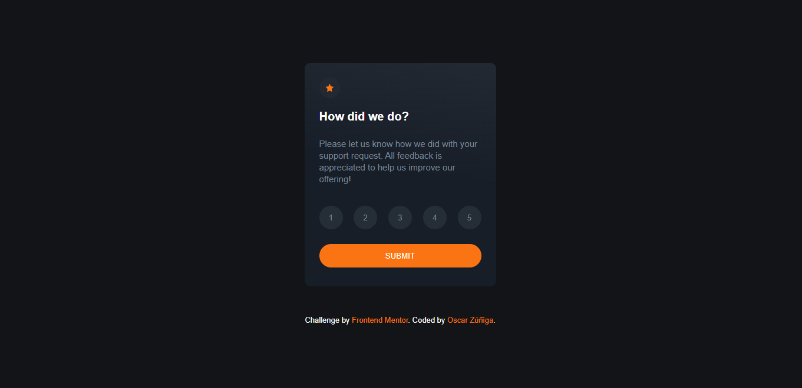

# Frontend Mentor - Interactive rating component solution

This is a solution to the [Interactive rating component challenge on Frontend Mentor](https://www.frontendmentor.io/challenges/interactive-rating-component-koxpeBUmI). Frontend Mentor challenges help you improve your coding skills by building realistic projects. 

## Table of contents

- [Overview](#overview)
  - [The challenge](#the-challenge)
  - [Screenshot](#screenshot)
  - [Links](#links)
- [My process](#my-process)
  - [Built with](#built-with)
- [Author](#author)
- [Acknowledgments](#acknowledgments)

## Overview

### The challenge

Users should be able to:

- View the optimal layout for the app depending on their device's screen size
- See hover states for all interactive elements on the page
- Select and submit a number rating
- See the "Thank you" card state after submitting a rating

### Screenshot

### Links

- Live Site URL: [Interactive rating component solution](https://1994oscar.github.io/interactive-rating-component-chlg-01/)

## My process

### Built with

- Flexbox
- Mobile-first workflow
- Node-Sass

### Useful resources

- [CSS Gradient Generator](https://cssgradient.io/) - This helped me to create a good linear gradient in css.

## Author

- Website - [Oscar Zúñiga](https://www.xn--oscarziga-q6a2h.com/)
- Frontend Mentor - [@1994oscar](https://www.frontendmentor.io/profile/1994oscar)

